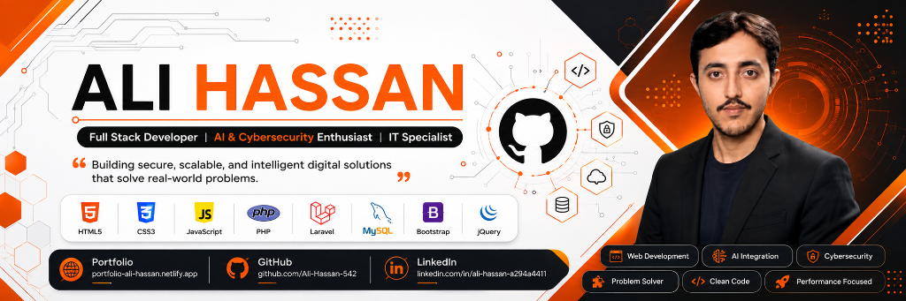

<!-- ============================================= -->
<!--   Banner (hosted inside the repo -> 100% loads) -->
<!-- ============================================= -->
<!-- BANNER DISABLED - uncomment below when ready to display
<p align="center">
  
</p>
-->

<!-- ============================================= -->
<!--   Typing Animation                            -->
<!-- ============================================= -->
<p align="center">
  
</p>

<!-- ============================================= -->
<!--   Quick Links & Socials                       -->
<!-- ============================================= -->
<p align="center">
  <a href="https://portfolio-ali-hassan.netlify.app">
    
  </a>
  <a href="https://www.linkedin.com/in/ali-hassan-a294a4411">
    
  </a>
  <a href="mailto:ali78601hassan@gmail.com">
    
  </a>
  <a href="https://github.com/Ali-Hassan-542">
    
  </a>
  <a href="https://komarev.com/ghpvc/?username=Ali-Hassan-542&style=for-the-badge&color=36BCF7&label=PROFILE+VIEWS">
    
  </a>
</p>

<!-- ============================================= -->
<!--   Table of Contents (working anchor links)    -->
<!-- ============================================= -->
<p align="center">
  <a href="#-about-me">About</a> •
  <a href="#-tech-stack">Tech Stack</a> •
  <a href="#-featured-projects">Projects</a> •
  <a href="#-certifications">Certifications</a> •
  <a href="#-github-stats">GitHub Stats</a> •
  <a href="#-contribution-graph">Activity</a> •
  <a href="#-snek-animation">Snek</a> •
  <a href="#-connect-with-me">Contact</a>
</p>

---

<!-- ============================================= -->
<!--   About Me                                    -->
<!-- ============================================= -->
## 👨‍💻 About Me

```text
Name      : Ali Hassan
Role      : Full Stack Developer | Backend AI Engineer | IT Support & Cloud Enthusiast
Education : BS Computer Software Engineering @ UMT Lahore (2022 - 2026)
Current   : Backend AI Engineering Intern @ FlyRank AI (US-based)
             Junior AI Consultant @ HSI TEAM (US-based)
Experience: Former Intern @ Systems Limited
Focus     : Secure Backend Systems · AI-Powered Solutions · Cloud & DevOps
Learning  : LLMs · Docker · Kubernetes · Cloud Infrastructure
Fun Fact  : I turn complex problems into elegant, real-world software 💡
```

I'm a **Full Stack Developer** with a strong foundation in **C++** and deep experience building robust, scalable web applications. My journey started with C++ — mastering data structures, algorithms, and memory management — which sharpened my analytical approach to problem solving.

I specialize in **PHP/Laravel + MySQL** backend architecture and **Python** for automation and data-driven solutions. Currently exploring **AI/ML, LLMs, Docker, and DevOps** to build intelligent, production-ready systems. With **IELTS C1 (British Council)** certification, I collaborate comfortably with international teams.

---

<!-- ============================================= -->
<!--   Tech Stack                                  -->
<!-- ============================================= -->
<hr>

## 🛠️ Tech Stack

### Frontend Development

<table>
  <tr>
    <td align="center" width="90">
      <br>
      <sub><b>React</b></sub>
    </td>
    <td align="center" width="90">
      <br>
      <sub><b>JavaScript</b></sub>
    </td>
    <td align="center" width="90">
      <br>
      <sub><b>TypeScript</b></sub>
    </td>
    <td align="center" width="90">
      <br>
      <sub><b>HTML5</b></sub>
    </td>
    <td align="center" width="90">
      <br>
      <sub><b>CSS3</b></sub>
    </td>
    <td align="center" width="90">
      <br>
      <sub><b>Flutter</b></sub>
    </td>
    <td align="center" width="90">
      <br>
      <sub><b>Vite</b></sub>
    </td>
  </tr>
</table>

### Backend Development

<table>
  <tr>
    <td align="center" width="90">
      <br>
      <sub><b>PHP</b></sub>
    </td>
    <td align="center" width="90">
      <br>
      <sub><b>Laravel</b></sub>
    </td>
    <td align="center" width="90">
      <br>
      <sub><b>Node.js</b></sub>
    </td>
    <td align="center" width="90">
      <br>
      <sub><b>Python</b></sub>
    </td>
    <td align="center" width="90">
      <br>
      <sub><b>C++</b></sub>
    </td>
  </tr>
</table>

### Database & DevOps

<table>
  <tr>
    <td align="center" width="90">
      <br>
      <sub><b>MySQL</b></sub>
    </td>
    <td align="center" width="90">
      <br>
      <sub><b>MongoDB</b></sub>
    </td>
    <td align="center" width="90">
      <br>
      <sub><b>Git</b></sub>
    </td>
    <td align="center" width="90">
      <br>
      <sub><b>GitHub</b></sub>
    </td>
    <td align="center" width="90">
      <br>
      <sub><b>Linux</b></sub>
    </td>
    <td align="center" width="90">
      <br>
      <sub><b>Postman</b></sub>
    </td>
  </tr>
</table>

### Cloud & AI Tools

<table>
  <tr>
    <td align="center" width="90">
      <br>
      <sub><b>AWS</b></sub>
    </td>
    <td align="center" width="90">
      <br>
      <sub><b>Docker</b></sub>
    </td>
    <td align="center" width="90">
      <br>
      <sub><b>Firebase</b></sub>
    </td>
    <td align="center" width="90">
      <br>
      <sub><b>Figma</b></sub>
    </td>
  </tr>
</table>

<hr>

---

<!-- ============================================= -->
<!--   Featured Projects (all links verified)      -->
<!-- ============================================= -->
## 🚀 Featured Projects

<table align="center">
  <tr>
    <td align="center" width="50%">
      <h3>🩺 PRMS — Patient Record Management System</h3>
      <p>Secure web-based healthcare platform for digitizing patient records, appointments, billing & role-based admin control.</p>
      <b>PHP · MySQL · Bootstrap · JavaScript</b><br/><br/>
      <a href="https://github.com/Ali-Hassan-542/Patient-Record-Management-System">
        
      </a>
    </td>
    <td align="center" width="50%">
      <h3>📡 SafeTrack — Online Tracking Web App</h3>
      <p>Consent-based live location tracking demo with Leaflet maps, permission & consent management. Privacy-first design.</p>
      <b>JavaScript · Bootstrap 5 · Leaflet · PHP</b><br/><br/>
      <a href="https://github.com/Ali-Hassan-542/Online-Tracking-Web-App">
        
      </a>
    </td>
  </tr>
  <tr>
    <td align="center" width="50%">
      <h3>👗 Elegant Wear — E-Commerce Platform</h3>
      <p>Premium un-stitched women's clothing store with product catalog, cart, secure checkout & admin dashboard.</p>
      <b>HTML · CSS · JavaScript · PHP</b><br/><br/>
      <a href="https://github.com/Ali-Hassan-542/Elegant-Wear">
        
      </a>
    </td>
    <td align="center" width="50%">
      <h3>📺 IPTV — Streaming + Admin Dashboard</h3>
      <p>Complete IPTV solution with live TV, VOD library, subscription plans & a powerful admin panel.</p>
      <b>HTML · CSS · JavaScript</b><br/><br/>
      <a href="https://github.com/Ali-Hassan-542/IPTV-Complete-with-Admin-Dashboard">
        
      </a>
    </td>
  </tr>
</table>

<p align="center">
  <a href="https://github.com/Ali-Hassan-542?tab=repositories">
    
  </a>
</p>

---

<!-- ============================================= -->
<!--   Certifications                              -->
<!-- ============================================= -->
## 🏅 Certifications

| Credential | Issuer | Status |
| --- | --- | --- |
| 🧠 Full Stack Development | Professional Certification | ✅ Certified |
| 🗣️ IELTS Academic (B2 Advanced) | British Council | ✅ Certified |
| 🖧 Cisco Networking | Cisco | ✅ Certified |
| 💻 C++ Programming & OOP | Professional Certification | ✅ Certified |
| 🤝 Soft Skills (Leadership & Teamwork) | Professional Certification | ✅ Certified |

---

<!-- ============================================= -->
<!--   GitHub Stats                                -->
<!-- ============================================= -->
## 📊 GitHub Stats

<p align="center">
  
  
</p>

<p align="center">
  
</p>

---

<!-- ============================================= -->
<!--   Contribution Graph                          -->
<!-- ============================================= -->
## 📈 Contribution Graph

<p align="center">
  <a href="https://github.com/Ashutosh00710/github-readme-activity-graph">
    
  </a>
</p>

---

<!-- ============================================= -->
<!--   Snek Animation                              -->
<!-- ============================================= -->
## 🐍 Snek Animation

<p align="center">
  
</p>

---

<!-- ============================================= -->
<!--   Quote                                       -->
<!-- ============================================= -->
<p align="center">
  
</p>

---

<!-- ============================================= -->
<!--   Contact                                     -->
<!-- ============================================= -->
## 📬 Connect With Me

<p align="center">
  <a href="https://portfolio-ali-hassan.netlify.app">
    
  </a>
  <a href="https://www.linkedin.com/in/ali-hassan-a294a4411">
    
  </a>
  <a href="mailto:ali78601hassan@gmail.com">
    
  </a>
</p>

<p align="center">
  <i>"Code with Logic. Build with Passion."</i>
</p>

<p align="center">
  
</p>
